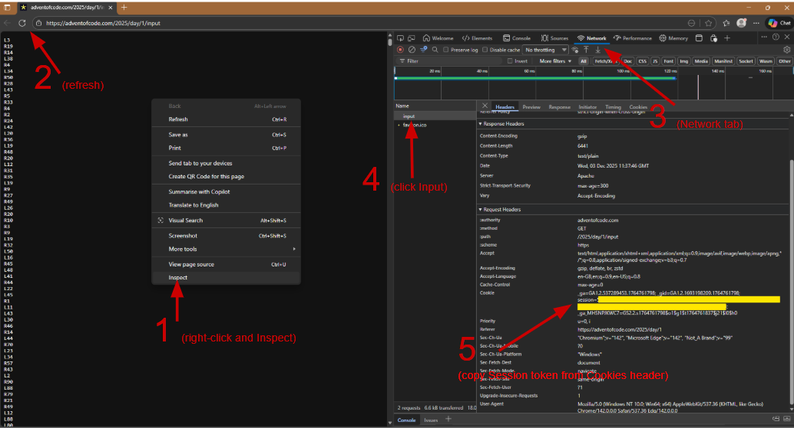

# Advent of Code (AoC)

## What is AoC 🧩

[Advent of Code](https://adventofcode.com/2025/about) is an annual December calendar event of small programming puzzles . They are intended to cover a variety of skill levels, and are solved in all manner of programming languages.  

Simply sign-up, and challenge yourself.

The challenges are published daily in December, and for 2025 there are 12 days of puzzles. Previous years puzzles are available, so even if you are late or missed one, don't worry, the puzzles will be there for you to catch-up on or simply randomly challenge yourself on.
There are optional leader boards, (brevity, speed, etc), or just use the puzzles as coding practice.

There is no deadline.

Embrace the challenge 😊

## Setup

I've created my own python script, `setup_aoc.py`, to create an AoC folder structure populated with some simple boilerplated code files to get me started.

There are a number of these AoC creation scripts on GitHub, but I wanted to create my own.

### Requirements

**Required:**

- [advent-of-code-data](https://pypi.org/project/advent-of-code-data/2.1.0): PyPi package to download the AoC input data for published puzzles
- `.session` file: this file containing the AoC session token for your AoC login
  - see the [AoC Session ID Token](#aoc-session-id-token) section for how to get this

**Optional:**

- PyTest: no tests have been written for the setup script, but it is assumed each challenge will have a test file for the challenge code
- MyPy: optional, but good practice

### Creating a Folder Structure

I use the UV project environment to easily setup a project structure:

`uv init --package --name aoc  # create a project with a ./src/aoc structure`

The I use my `setup_aoc.py` script to create a folders based on a year/day basis:

```text
usage: setup_aoc.py [-h] [-i Days Year] [-f Day Year]

options:
  -h, --help            show this help message and exit
  -i, --init Days Year  create 'days' folders under 'year' folder, e.g. -i 12 2025
  -f, --fetch Day Year  get AoC input data for given 'day' and 'year', e.g. -f 1 2025
```

The `-i` option initialises/creates the folder structure for the passed **number** of days for the given year. For example:

`uv run python ./setup_aoc.py -i 12 2025`

This would create and initialise folders for sequential days 1-12 for year 2025:

```text {linenos=inline hl_lines=[4]}
src/
├─ aoc/
   ├─ 2025/
      ├─ day_01/
      │  ├─ aoc_code.py
      │  ├─ test_aoc_code.py
      ├─ day_02/
      ├─ day_03/
      .......
      .......
      ├─ day_11/
      ├─ day_12/
```

The script deliberately creates a simple and bare layout. I did not want to pollute the layout with `__init__.py` files, individual `README.md` files, etc, etc. I want it simple and clean, any "*fluff*" can be added as each days challenge is completed.

### Getting the AoC Input Data

You can only get data for published challenges.  
The script only gets data for individual days.

`uv run python ./setup_aoc.py -f 1 2025`

This would fetch the AoC input data for day 1 of year 2025:

```text {linenos=inline hl_lines=[6]}
src/
├─ aoc/
   ├─ 2025/
   │  ├─ day_01/
   │  │  ├─ aoc_code.py
   │  │  ├─ input.txt
   │  │  ├─ test_aoc_code.py
   │  ├─ day_02/
 
```

## Running and Testing Code Challenges

I use UV for running the code scripts and testing with PyTest.

```pwsh
# Examples
uv run ./src/aoc/2025/day_01/aoc_code.py

uv run pytest ./src/aoc/2025/day_01/ -rs -v

uv run mypy --strict ./src/aoc/2025/day_01/  # optional
```

Because of the sparse folder structure, I'd recommend running explicitly against individual files/folders. Trying to test on a wider folder range will require including `__init__.py` files and overcoming duplicate module names when running MyPy.

## AoC Session ID Token

In order to use the [advent-of-code-data](https://pypi.org/project/advent-of-code-data/2.1.0) package, you need the session token for your AoC login.  
In order to get ths, use your browsers '*Inspect*" code functionality to find the session ID from the cookies when you are logged in to AoC.

- Steps
  - Login to AoC and go to one of the input data pages
  - Right-click to "*Inspect*" code
    - You want your browsers code analysis functionality here
  - Refresh the AoC page to capture the underlying webpage information
  - View the '*Network*' Parameters (page assets)
  - Find the "*Session*" token within the headers section
    - The ID token is a looong alphanumeric string
  - Save that token in a file called `.session` in the project root



There is an experimental option in the `advent-of-code-data` package that attempts to get the session ID for you from your cookies. This is the `aocd-token` command, but I did not have success with it.

Currently the script expects the token to be in a `.session` file, but you can use and Environment Variable if you wanted, e.g.:

```text
# Powershell - current console
$ENV:AOC_SESSION="1234qwerty"
ls env: 

# Bash - current shell
export AOC_SESSION=1234qwerty
export
```

There is a commented out line of code in the script to allow env use if it was needed.

### References

- [About AoC](https://adventofcode.com/2025/about)
- [Info on obtaining Session Token](https://github.com/wimglenn/advent-of-code-wim/issues/1?)
- Solutions: *<-- but don't cheat!*
  - [advent-of-code-wim](https://pypi.org/project/advent-of-code-wim/2025.1/)
  - [Algorithmist on YouTube](https://www.youtube.com/@Algorithmist)
  - [salt-die (some with visuals)](https://github.com/salt-die/Advent-of-Code/tree/main/2025)
  - [awesome-advent-of-code](https://github.com/Bogdanp/awesome-advent-of-code?tab=readme-ov-file#python)
